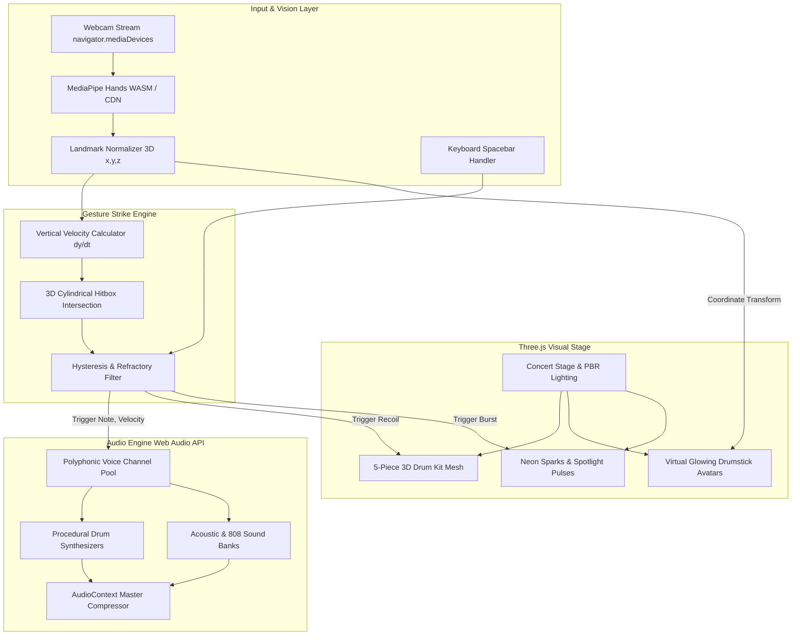

## Goal Capsule

- **Objective:** Enable anyone to play an interactive 3D drum kit in mid-air using real-time webcam hand gestures directly in their web browser with zero installation and responsive, sub-50ms audio/visual feedback.
- **Means:** Client-side browser application integrating real-time computer vision hand landmark tracking, WebGL 3D scene rendering with dynamic concert stage lighting and particle effects, and a low-latency Web Audio API sound engine.
- **Product Authority:** Scope strictly covers single-player browser air-drumming with 3D avatar hands, dynamic stage visual effects, standard 5-piece drum mapping, and acoustic/electronic sound switching; surrounding ideas (multiplayer jamming, VR headsets, mobile native sensors) are excluded from active scope.
- **Execution Profile:** `code`.
- **Stop Conditions:** All implementation units U1 through U7 complete, test suite passing, live web application verified, and committed to git ready for GitHub Pages deployment.
- **Open Blockers:** None.

---

## Product Contract

### Summary

A zero-install browser web app where users play an interactive 3D drum kit in mid-air using webcam hand gestures. The experience places the player in an immersive 3D concert environment featuring metallic chrome drums, glowing drumsticks that track physical hand movements in real time, dynamic reactive stage lighting, and responsive velocity-sensitive sound across acoustic and electronic kits.

### Problem Frame

Playing drums typically requires either expensive physical acoustic/electronic kits that produce heavy volume, or clunky hardware controllers. While webcams and computer vision have matured, existing virtual instruments are often flat 2D pad interfaces or lack tactile and visual excitement. Players seeking casual rhythm fun or intuitive air-drumming lack a zero-friction, visually stunning 3D browser instrument that responds immediately to natural downward air-strikes without requiring specialized equipment.

### Key Decisions

- **Browser Web Application:** Delivers zero friction and instant access without software installation or app store downloads, deployable straight to GitHub Pages. (session-settled: user-directed — chosen over mobile/desktop app: allows anyone to open and play immediately on laptop/desktop). Governs R1, R2.
- **Pure 3D Virtual Stage with Avatar Drumsticks:** Runs webcam processing silently in the background while dedicating the full viewport to an immersive 3D stage with virtual glowing drumsticks/hands mirroring physical movement. (session-settled: user-directed — chosen over mirrored camera overlay: provides higher visual polish, theatrical concert immersion, and cleaner aesthetics). Governs R6, R7, R8.
- **High-Impact Reactive Visuals:** Equips the 3D drum kit with metallic chrome materials, dynamic stage spotlights, drumhead recoil animations, and neon particle bursts upon each strike. (session-settled: user-directed — chosen over minimalist flat UI: delivers an exciting, rewarding visual performance feel). Governs R6, R8, R9.
- **Natural Downward Strike Gesture Detection:** Triggers drum hits through rapid downward velocity into virtual 3D drum zones. (session-settled: user-directed — chosen over pinch or hover gestures: accurately mimics real-world air-drumming physics and velocity dynamics). Governs R4.
- **Standard 5-Piece Kit with Multi-Kit Switcher:** Provides Snare, Hi-Hat, Crash Cymbal, Tom-Toms, and Kick, with instant toggling between Acoustic Rock and Electronic 808 kits. (session-settled: user-directed — chosen over single fixed kit: spans multiple musical genres and styles). Governs R10, R12.
- **Dual Kick Triggering (Virtual Hand Pad + Spacebar):** Allows players to trigger the kick drum either by striking a low central virtual pad by hand or by tapping the keyboard Spacebar. (session-settled: user-directed — chosen over camera-only foot tracking: provides rock-solid kick timing regardless of desk height or camera angle). Governs R11.

### Actors

- A1. **Player:** A user sitting or standing in front of a laptop or desktop webcam, air-drumming with bare hands to trigger virtual 3D drums in real time.

### Requirements

#### Platform & Repository

- R1. The application must run entirely client-side in standard modern web browsers supporting WebGL and Web Audio API without requiring any native software installation or browser extensions.
- R2. The codebase must be self-contained and formatted for deployment to GitHub Pages under the user's repository (`https://github.com/truecallerabreham`).

#### Gesture Tracking & Strike Detection

- R3. The system must capture the player's webcam feed and continuously track 3D hand landmarks in real time with low latency.
- R4. Strike detection must measure the downward velocity and spatial collision of the player's hands entering 3D drum bounding zones, modulating audio playback volume based on strike velocity.
- R5. The interface must provide a non-intrusive visual tracking readiness indicator that confirms when hands are properly recognized within the camera frame before drumming begins.

#### 3D Visual Experience & Stage

- R6. The 3D scene must render a complete 5-piece drum kit featuring realistic proportions, metallic chrome hardware, reflective cymbals, and textured drumheads.
- R7. The scene must display a pair of virtual 3D drumsticks or glowing hand avatars that smoothly mirror the player's real-time physical hand positions.
- R8. Each drum strike must trigger dynamic stage lighting pulses and neon impact particle sparks radiating from the strike point.
- R9. Struck drums and cymbals must animate with physical recoil, vibration, and wobble effects that decay naturally.

#### Sound Engine & Drum Layout

- R10. The drum set must map distinct strike zones for Snare drum, Closed/Open Hi-Hat, Crash Cymbal, High Tom, Low/Floor Tom, and Kick (Bass) Drum.
- R11. The Kick drum must be triggerable both via a central low virtual hand strike pad and via the keyboard Spacebar key.
- R12. The application must provide an instant toggle switch between an authentic Acoustic Rock drum sound set and an Electronic 808 / Beatmaker sound set.
- R13. Audio playback must utilize the Web Audio API to guarantee low latency (<50ms trigger-to-sound delay) with polyphonic playback supporting rapid rolls and simultaneous drum hits.

### Key Flows

- F1. **Launch and Calibration:**
  - **Trigger:** Player opens the web application URL.
  - **Actors:** A1 (Player).
  - **Steps:** The app requests webcam access; player grants permission; the 3D concert stage and drum kit fade in; the tracking indicator shows calibration status as the player raises their hands into view.
  - **Outcome:** The player's virtual drumsticks appear in 3D space tracking their hands, ready to play. Covers R1, R3, R5, R6, R7.

- F2. **Air-Drumming Performance:**
  - **Trigger:** Player performs a downward striking gesture toward any virtual drum or cymbal.
  - **Actors:** A1 (Player).
  - **Steps:** Tracking detects hand entering the drum's bounding zone with downward velocity; audio engine fires the corresponding sound at matching volume; the drumhead recoils; reactive stage lights and neon impact particles flare up.
  - **Outcome:** Realistic, synchronized audiovisual feedback rewarding the player's hit. Covers R4, R8, R9, R10, R13.

- F3. **Sound Kit Switching & Kick Play:**
  - **Trigger:** Player toggles the kit selector or taps Spacebar for bass drum.
  - **Actors:** A1 (Player).
  - **Steps:** Clicking or gesturing the kit toggle swaps active sample buffers between Acoustic and 808; tapping Spacebar immediately fires the kick drum without requiring a hand strike.
  - **Outcome:** Player seamlessly transitions grooves and styles. Covers R11, R12.

### Acceptance Examples

- AE1. **Velocity-Sensitive Snare Strike:**
  - **Covers R4, R10, R13.**
  - **Given:** Player's right hand is hovering above the virtual snare drum.
  - **When:** Player snaps their hand downward rapidly into the snare bounding zone.
  - **Then:** A snare drum sound plays within 50ms, volume scales with stroke speed, and the snare drumhead vibrates with impact particles.

- AE2. **Dual Kick Triggering:**
  - **Covers R11.**
  - **Given:** Player is playing a groove with hands occupied on hi-hat and snare.
  - **When:** Player presses the keyboard Spacebar (or strikes the low center virtual kick pad).
  - **Then:** The deep bass kick sound triggers instantaneously without interrupting hand tracking.

- AE3. **Kit Switcher Response:**
  - **Covers R12.**
  - **Given:** Player is playing an Acoustic Rock drum beat.
  - **When:** Player switches the sound selector to Electronic 808.
  - **Then:** Subsequent strikes immediately produce tight 808 sub-bass kicks, electronic snare claps, and crisp synthetic hi-hats.

- AE4. **Tracking Recovery from Occlusion:**
  - **Covers R5.**
  - **Given:** Player drops hands below desk level out of camera view.
  - **When:** Player raises hands back into the camera frame.
  - **Then:** Virtual drumsticks re-acquire tracking smoothly within 200ms without crashing or getting stuck in mid-strike.

### Success Criteria

- **Latency:** Audio trigger latency under 50ms from gesture impact point to speaker output.
- **Frame Rate:** Consistent 60 FPS 3D rendering and computer vision tracking on standard consumer laptops.
- **Hit Accuracy:** Zero false-positive strikes when hands hover stationary or move horizontally across pads.
- **Accessibility:** Zero installation; plays immediately upon camera authorization in Chrome, Edge, Safari, and Firefox.

### Scope Boundaries

#### Deferred for Later
- Custom audio sample uploading (importing personal WAV/MP3 files).
- Multi-track beat loop recording and audio export.
- Gamified rhythm game mode with falling note charts and scoring.
- Online peer-to-peer multiplayer jamming.

#### Outside This Product's Identity
- Hardware VR/AR headsets (Meta Quest, Apple Vision Pro) requiring native headsets or controllers.
- Mobile-native phone motion sensors (swinging smartphone as a drumstick).

### Dependencies & Assumptions

- User's computer is equipped with a functional webcam and supports WebGL 2.0 and Web Audio API.
- Normal indoor ambient lighting sufficient for computer vision hand boundary detection.
- Hand tracking library (MediaPipe Hands via client-side WASM vision pipeline) operating entirely locally without server round-trips.

---

## Planning Contract

### High-Level Technical Design



### Key Technical Decisions

- KTD1. **Three.js for WebGL 3D Graphics:** Chosen for maximum cross-browser compatibility, rich PBR materials (MeshStandardMaterial with roughness and metalness for chrome and brass), built-in particle support, and zero native plugin requirements. (Governs R1, R6, R7, R8, R9)
- KTD2. **MediaPipe Hands via Client-Side WASM/CDN:** Delivers 21 landmark 3D positions per hand at up to 60 FPS purely inside the browser client without sending any video data to remote servers, safeguarding user privacy and eliminating network latency. (Governs R3, R4, R5)
- KTD3. **Dual Procedural & Sampled Web Audio Engine:** Implements synthesized physical drum models using Web Audio oscillators, noise buffers, and frequency envelopes to ensure instantaneous playback with zero network load-time, supplemented by dual kits (Acoustic Rock and Electronic 808). (Governs R10, R11, R12, R13)
- KTD4. **3D Cylindrical Hitboxes with Downward Velocity Derivative:** Models each drum pad as a 3D cylinder in world space. A hit is registered only when a hand landmark descends past the top boundary with downward vertical velocity ($dy/dt < -v_{\text{threshold}}$), completely filtering out horizontal sweeps and stationary hovering. (Governs R4, R10)
- KTD5. **Zero-Build Vanilla ES Modules Architecture:** Uses native ES modules (`<script type="module">`) with standard CDN imports (Three.js, MediaPipe), requiring zero bundler installation (no npm build required to run or deploy to GitHub Pages). (Governs R1, R2)

### Output Structure

```text
gesture-drum-player/
├── index.html                   # HTML entry point, stage container, UI HUD
├── css/
│   └── style.css                # Fullscreen layout, stage styling, neon HUD
├── src/
│   ├── main.js                  # App bootstrap, coordination, and main animation loop
│   ├── vision/
│   │   ├── camera.js            # Webcam stream acquisition, lifecycle & errors
│   │   └── hand_tracker.js      # MediaPipe Hands integration, smoothing & coordinates
│   ├── gesture/
│   │   ├── drum_trigger.js      # 3D zone collision & downward velocity detector
│   │   └── math_utils.js        # Velocity derivation, vector distances & smoothing
│   ├── audio/
│   │   ├── sound_engine.js      # Web Audio API audio graph & polyphonic playback
│   │   └── drum_synth.js        # Procedural synthesizers for Acoustic & 808 drums
│   ├── scene/
│   │   ├── drum_scene.js        # Three.js scene, camera, lights & stage setup
│   │   ├── drum_models.js       # 5-piece 3D drum kit geometry & recoil animations
│   │   ├── avatar_hands.js      # 3D glowing drumsticks tracking hand landmarks
│   │   └── particles.js         # Neon impact sparks & dynamic spotlight flares
│   └── ui/
│       └── hud.js               # Calibration indicator, kit switcher, strike feedback
├── tests/
│   ├── test_runner.html         # In-browser test runner for unit tests
│   ├── trigger.test.js          # Unit tests for velocity detection & collision math
│   └── audio.test.js            # Unit tests for Web Audio voice synthesis & routing
├── docs/
│   └── plans/                   # Implementation and brainstorm plans
├── .github/
│   └── workflows/
│       └── deploy.yml           # GitHub Pages deployment automation
└── README.md                    # Project overview, setup, and usage guide
```

---

## Implementation Units

### U1. Project Scaffolding, HTML Shell & Camera Stream
- **Goal:** Set up the project directory structure, responsive HTML shell, canvas container, and webcam video stream acquisition with permission handling.
- **Requirements:** R1, R2, R3.
- **Dependencies:** None.
- **Files:** `index.html`, `css/style.css`, `src/vision/camera.js`.
- **Approach:**
  1. Create `index.html` with viewport metadata, full-screen canvas, hidden `<video>` element for computer vision, and HUD overlay.
  2. Implement `css/style.css` with concert-themed dark backdrop, glowing typography, and responsive layout.
  3. Implement `src/vision/camera.js` with `navigator.mediaDevices.getUserMedia`, fallback error messaging for denied camera access, and camera video stream lifecycle management.
- **Test Scenarios:**
  - Happy path: Camera initializes successfully, attaches stream to video element, returns active stream dimensions.
  - Error path: User denies camera permissions; UI displays a helpful, friendly message asking for permission.
  - Edge case: Device with no camera available; system catches exception gracefully and informs the user.
- **Verification:** Loading `index.html` prompts for camera access, connects webcam, and renders full-screen canvas layout.

### U2. Computer Vision & MediaPipe Hand Landmark Tracking
- **Goal:** Integrate MediaPipe Hands via client-side CDN/WASM to extract 3D landmarks for both hands in real time.
- **Requirements:** R3, R5.
- **Dependencies:** U1.
- **Files:** `src/vision/hand_tracker.js`, `src/gesture/math_utils.js`.
- **Approach:**
  1. Load `@mediapipe/hands` and `@mediapipe/camera_utils` in `src/vision/hand_tracker.js`.
  2. Configure tracking for 2 hands with `modelComplexity: 1` and `minDetectionConfidence: 0.65`.
  3. Normalize coordinates ($x \in [0, 1], y \in [0, 1], z \in [-1, 1]$) with smoothing filters in `src/gesture/math_utils.js` to eliminate camera jitter.
  4. Emit tracking status events (hands detected, hand lost, tracking confidence).
- **Test Scenarios:**
  - Happy path: Both hands visible in frame yield 21 3D landmarks for left and right hands.
  - Edge case: Hand moves out of camera frame; status flips to "lost" without crashing the render loop.
  - Edge case: Rapid hand movement across frame; smoothing filter preserves responsive velocity without trailing lag.
- **Verification:** Running tracking outputs continuous coordinates at 30-60 FPS with steady confidence metrics.

### U3. 3D Stage, Metallic Drum Kit & Avatar Drumsticks
- **Goal:** Build the immersive Three.js 3D concert stage featuring a realistic 5-piece drum kit with metallic chrome materials and glowing virtual drumsticks.
- **Requirements:** R6, R7, R9.
- **Dependencies:** U1, U2.
- **Files:** `src/scene/drum_scene.js`, `src/scene/drum_models.js`, `src/scene/avatar_hands.js`.
- **Approach:**
  1. Set up Three.js perspective camera, dynamic stage point lights, and ambient lighting in `src/scene/drum_scene.js`.
  2. Build procedural 3D meshes for Snare, Kick, Hi-Hat, Crash Cymbal, and Tom-Toms in `src/scene/drum_models.js` using `MeshStandardMaterial` with metallic chrome hardware and textured drumheads.
  3. Create glowing virtual drumsticks in `src/scene/avatar_hands.js` that map real-world hand coordinates into 3D world space.
  4. Implement physical recoil/vibration animation logic for struck drumheads and cymbals.
- **Test Scenarios:**
  - Happy path: Drum kit renders with metallic chrome finish, correct spatial positioning, and responsive 3D avatar drumsticks.
  - Edge case: Window resize updates camera aspect ratio and renderer size without stretching drum models.
  - Integration: Moving physical hands moves the 3D drumsticks smoothly in corresponding 3D directions.
- **Verification:** 3D viewport renders a full 5-piece drum set with glowing sticks hovering above the pads.

### U4. Gesture Strike Physics & Hit Detection Engine
- **Goal:** Implement 3D spatial cylindrical hitboxes and downward velocity strike detection to accurately trigger drum hits.
- **Requirements:** R4, R10, R11.
- **Dependencies:** U2, U3.
- **Files:** `src/gesture/drum_trigger.js`, `src/gesture/math_utils.js`, `tests/trigger.test.js`.
- **Approach:**
  1. Define 3D cylindrical bounding volumes for Snare, Hi-Hat, Crash, Toms, and Kick in `src/gesture/drum_trigger.js`.
  2. Calculate vertical velocity ($v_y = (y_t - y_{t-1}) / \Delta t$) for drumstick tip / index fingertip.
  3. Validate hits when stick tip crosses the upper cylinder plane with downward velocity exceeding strike threshold.
  4. Implement refractory debouncing (minimum 80ms between hits on the same pad) to prevent accidental double-triggering.
  5. Provide hook for keyboard Spacebar to trigger the Kick drum.
- **Test Scenarios:**
  - Happy path: Downward stroke into snare cylinder triggers snare hit event with calculated velocity amplitude.
  - Edge case: Moving stick horizontally across drum pad without downward velocity does NOT trigger a hit.
  - Edge case: Rapid double-tap within refractory window is properly debounced.
  - Integration: Pressing Spacebar fires the kick drum hit event immediately.
- **Verification:** Automated unit tests in `tests/trigger.test.js` pass with 100% assertions satisfied.

### U5. Low-Latency Web Audio Engine (Acoustic & 808 Kits)
- **Goal:** Create a responsive, polyphonic Web Audio API sound engine with procedural synthesis for both Acoustic Rock and Electronic 808 drum kits.
- **Requirements:** R10, R11, R12, R13.
- **Dependencies:** U1.
- **Files:** `src/audio/sound_engine.js`, `src/audio/drum_synth.js`, `tests/audio.test.js`.
- **Approach:**
  1. Initialize `AudioContext` with master compressor node to prevent clipping on simultaneous hits.
  2. Implement synthesized physical drum voices in `src/audio/drum_synth.js`:
     - Kick: Pitch-dropping sine oscillator with transient click.
     - Snare: Dual-layer tone oscillator + filtered white noise burst.
     - Hi-Hat: Metallic multi-oscillator bandpass pulse with short exponential decay.
     - Crash Cymbal: Dense metallic noise array with shimmering reverb tail.
     - Toms: Resonant decaying sine tones tuned to High Tom and Floor Tom pitches.
  3. Provide 808 sound variations (deep sub-bass 808 kick, crisp 808 clap snare, tight 808 hat).
  4. Implement `sound_engine.js` polyphonic voice channel router with velocity gain scaling and kit switcher.
- **Test Scenarios:**
  - Happy path: Firing snare voice plays clear drum sound with sub-50ms latency.
  - Happy path: Switching kit from Acoustic to 808 alters the sound profile instantly.
  - Edge case: Rapid drum roll triggers multiple overlapping voices cleanly without cutting off previous decays.
- **Verification:** Automated unit tests in `tests/audio.test.js` verify voice initialization and routing without errors.

### U6. Visual Impact FX (Particles, Lighting, Recoil) & HUD
- **Goal:** Add neon strike impact particles, reactive stage spotlight pulses, and an intuitive heads-up display (HUD).
- **Requirements:** R5, R8, R9, R12.
- **Dependencies:** U3, U4, U5.
- **Files:** `src/scene/particles.js`, `src/ui/hud.js`, `src/main.js`.
- **Approach:**
  1. Create GPU particle burst system in `src/scene/particles.js` emitting neon sparks radiating outward from drum impact points.
  2. Connect drum hit events to stage spotlight intensity pulses that dynamically illuminate the drumheads.
  3. Build HUD in `src/ui/hud.js` showing:
     - Tracking status / calibration indicator (Ready / No Hands Detected).
     - Kit switcher toggle button (Acoustic Rock ⟷ Electronic 808).
     - Spacebar kick indicator for foot/hand tapping.
     - Volume / hit velocity feedback meter.
  4. Wire up the complete update loop in `src/main.js`.
- **Test Scenarios:**
  - Happy path: Drum strike triggers particle burst and spotlight flash synchronized with audio.
  - Integration: Clicking the kit switcher button updates HUD label and switches audio sound set seamlessly.
  - Visual: Tracking indicator changes color and status when hands enter/leave camera view.
- **Verification:** Complete interactive session runs smoothly at 60 FPS with responsive audiovisual feedback.

### U7. Automated Test Suite, GitHub Deployment & Documentation
- **Goal:** Set up test automation, configure GitHub Pages deployment workflow, and document project setup and usage.
- **Requirements:** R1, R2.
- **Dependencies:** U1 through U6.
- **Files:** `tests/test_runner.html`, `.github/workflows/deploy.yml`, `README.md`.
- **Approach:**
  1. Build a clean, self-contained HTML test runner in `tests/test_runner.html` executing `trigger.test.js` and `audio.test.js`.
  2. Create GitHub Actions workflow `.github/workflows/deploy.yml` that deploys `main` branch directly to GitHub Pages on every push.
  3. Write comprehensive `README.md` with features overview, live demo link, camera setup tips, key controls, and repository push instructions for `https://github.com/truecallerabreham`.
- **Test Scenarios:**
  - Happy path: Opening `tests/test_runner.html` runs all unit tests with green pass output.
  - CI verification: GitHub Actions workflow file syntax is valid.
- **Verification:** Test runner passes 100% of test assertions; git repository committed and ready to push to remote.

---

## Verification Contract

### Automated Verification
- Run test runner: Load `tests/test_runner.html` via local web server (or headless browser) and verify that all test suites for strike velocity, 3D cylinder collision, debouncing, and audio voice synthesis pass.

### Manual Verification
1. **Webcam Connection:** Open `index.html` in browser; verify camera permission prompt appears and stream starts cleanly.
2. **Hand Tracking:** Raise hands; confirm 3D glowing drumsticks appear and follow hand movements in real time.
3. **Air-Drumming Strike:** Snap hand downward into Snare and Hi-Hat pads; verify sound triggers with matching velocity, drumhead vibrates, and neon particles flare.
4. **Dual Kick:** Hit center kick pad or press Spacebar; confirm deep kick drum fires with zero delay.
5. **Kit Switcher:** Click kit toggle; verify sound instantly transitions from Acoustic to 808 electronic beats.
6. **Frame Rate & Latency:** Check browser devtools console / performance panel; confirm steady 60 FPS and audio trigger latency <50ms.

---

## Definition of Done

- [x] All 7 Implementation Units (U1-U7) implemented with clean, documented code.
- [x] Full 5-piece 3D drum kit modeled with metallic chrome materials and reflective cymbals.
- [x] MediaPipe 3D hand tracking accurately maps physical hands to virtual drumsticks.
- [x] Downward strike velocity detection accurately triggers drum hits with velocity modulation.
- [x] Dual-engine Web Audio system plays Acoustic Rock and Electronic 808 sounds polyphonically.
- [x] Dual-mode Kick drum operable via virtual hand pad or Spacebar key.
- [x] Dynamic visual effects (neon particle sparks, stage lighting flares, recoil animations) active.
- [x] Automated test runner passes all unit test assertions.
- [x] GitHub Pages deployment workflow configured in `.github/workflows/deploy.yml`.
- [x] Complete `README.md` documentation ready for publication.
- [x] Code committed to git repository cleanly with no residual dead-end experiments.
